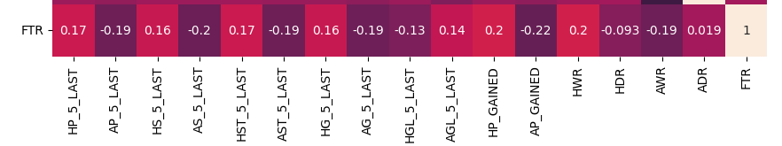
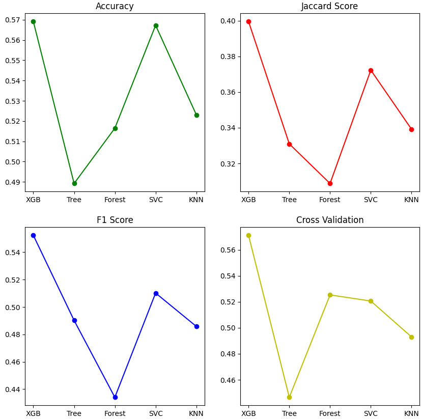
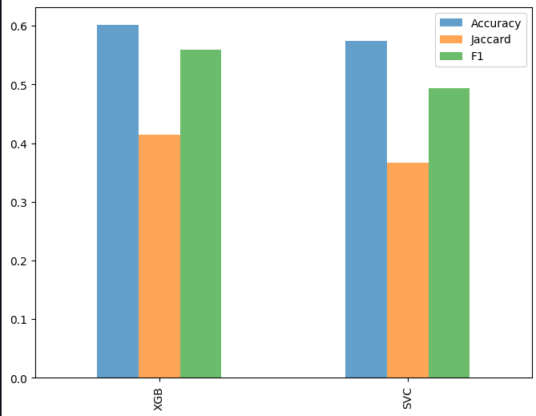

# Predicting Football Match Outcomes: 

## 📖 Project Overview  
This project focuses on predicting the outcomes of football matches in the top five European leagues: **La Liga**, **Serie A**, **Bundesliga**, **Premier League**, and **Ligue 1**. The task is to classify the match result into one of three categories:  
- **H**: Home Win  
- **D**: Draw  
- **A**: Away Win  

The dataset spans from the **2021/2022 season** to the **2024/2025 season**, providing a comprehensive foundation for building and evaluating predictive models.

---

## 📊 Dataset Description  
The dataset contains detailed match statistics:  
### Initial Columns:  
| Column | Description |
|--------|-------------|
| `Div` | League Division |
| `Date` | Match Date (dd/mm/yy) |
| `Time` | Match kick-off time |
| `HomeTeam` | Name of the Home Team |
| `AwayTeam` | Name of the Away Team |
| `FTHG`, `FTAG` | Full Time Goals (Home/Away Team) |
| `FTR` | Full Time Result (H=Home Win, D=Draw, A=Away Win) |
| `HTHG`, `HTAG` | Half Time Goals (Home/Away Team) |
| `HTR` | Half Time Result (H=Home Win, D=Draw, A=Away Win) |
| `HS`, `AS` | Total Shots (Home/Away Team) |
| `HST`, `AST` | Shots on Target (Home/Away Team) |

---

### 📈 Feature Engineering  
To enhance predictive accuracy, I introduced additional features based on the team's previous matches:  

1. **Team Form**:  
   - `HP_5_LAST`, `AP_5_LAST` : Points gained in the last 5 games for both teams.  

2. **Offensive and Defensive Strength**:  
   - `HS_5_LAST`, `AS_5_LAST`: Mean number of shots in last 5 games. 
   - `HST_5_LAST`, `AST_5_LAST`: Mean number of shots on target in last 5 games.  
   - `HG_5_LAST`, `AG_5_LAST`: Mean number of goals scored in last 5 matches.  
   - `HGL_5_LAST`, `AGL_5_LAST`: Mean number of goals conceded in last 5 matches.    

3. **Performance Metrics**:  
   - **Home/Away Win Rates**:  
     - `HWR`, `HDR`: Rate of wins and draws at home.  
     - `AWR`, `ADR`: Rate of wins and draws away.  
   - **Points gained so far in the season**:  
     - `HP_GAINED`: Home team’s accumulated points for specified season.  
     - `AP_GAINED`: Away team’s accumulated points for specified season.  

4. **Temporal Information**:  
   - `DPS`: Days since the start of the season for a match.  

### 🔍 Insights  
Correlation maps and visualizations were generated to analyze the relationship between these features and the target variable (`FTR`). Below is an example placeholder for one such correlation map:  

---

## 🚀 Model Development  
Several machine learning models were tested to predict match outcomes. The following models were evaluated:  
- **XGBClassifier**  
- **DecisionTreeClassifier**  
- **RandomForestClassifier**  
- **Support Vector Machine (SVM)**  
- **K-Nearest Neighbors (KNN)**  

### Model Performance Comparison  
Each model’s performance was compared using accuracy, jaccard, cross validation and F1-score. Below is a placeholder for the performance comparison graph:  

---

## 🛠 Hyperparameter Tuning  
The two best-performing models, **XGBClassifier** and **SVM**, were further fine-tuned to improve their performance:  
- **XGBClassifier**:  
  - Accuracy improved by **4%** after tuning.  
- **SVM**:  
  - Accuracy improved by **1%** after tuning.  

### Final Metrics for XGBClassifier and SVM  
A detailed metric comparison for the fine-tuned models is illustrated below:  

---

## 🏆 Final Results  
After rigorous testing and tuning, the **XGBClassifier** emerged as the best-performing model, achieving the following metrics on the test set:  
- **Accuracy**: **60%**  
- **Jaccard Score**: **41%**  
- **F1-Score**: **55%**  

---

## 🎨 Visualizations  
Visualizations demonstrating the importance of each feature, correlation analysis, and model performance are available in the notebook. These plots provide deeper insights into the factors influencing match outcomes.

---